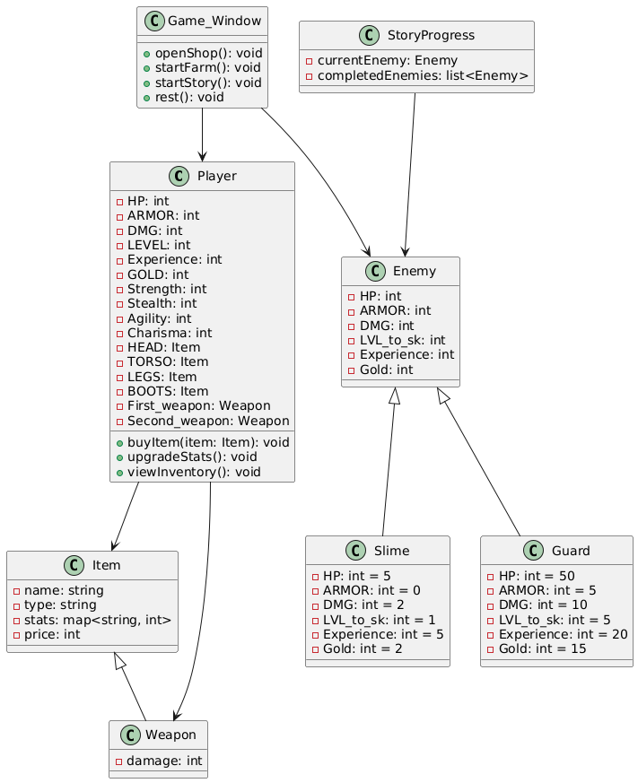

# Курсовой проект: Компьютерная текстовая RPG игра "Искупление"
## Описание проекта
Это текстовая ролевая игра (RPG), вдохновленная классическими играми, такими как Fallout 1 и 2. В отличие от оригиналов, в этой игре нет перемещения по карте — все действия выполняются через кнопки в игровом окне. Игрок управляет персонажем, прокачивает его характеристики, сражается с врагами, покупает предметы и проходит сюжетную линию. Игра включает механики инвентаря и скрытных убийств (с мини-игрой).
## Автор
Стецурин Елисей Олегович 353504
## Диаграмма классов

## Функциональные требования (Use Cases)
### 1. Покупка предметов
#### Актер: Игрок
#### Предусловие: Игрок находится в разделе "Магазин" в Game_Window, у игрока достаточно GOLD.
#### Основной сценарий:
Игрок нажимает кнопку "Магазин".
Система отображает список доступных предметов (HEAD, TORSO, LEGS, BOOTS, First_weapon, Second_weapon) с ценами.
Игрок выбирает предмет для покупки.
Система проверяет, достаточно ли у игрока GOLD с учетом скидки от Charisma.
Если GOLD достаточно, система вычитает стоимость из GOLD игрока и добавляет предмет (HEAD, TORSO, LEGS, BOOTS, First_weapon или Second_weapon) в инвентарь.
Система обновляет интерфейс игрока.
#### Альтернативный сценарий:
Если GOLD недостаточно, система выводит сообщение: "Недостаточно золота".
#### Постусловие: Предмет добавлен в инвентарь, GOLD уменьшено.

### 2. Прокачка характеристик персонажа
#### Актер: Игрок
#### Предусловие: У игрока достаточно Experience для повышения LEVEL.
#### Основной сценарий:
Игрок выбирает опцию "Прокачка статов".
Система отображает текущие характеристики (Strength, Stealth, Agility, Charisma) и доступные очки для прокачки (на основе LEVEL).
Игрок выбирает характеристику для улучшения.
Система увеличивает значение выбранной характеристики и обновляет связанные параметры (HP, DMG, ARMOR и т.д.).
Система обновляет интерфейс игрока.
#### Альтернативный сценарий:
Если LEVEL недостаточно, то кнопка прокачки некликабельна.
#### Постусловие: Характеристики улучшены.

### 3. Управление инвентарем
#### Актер: Игрок
#### Предусловие: Игрок находится в разделе "Инвентарь" в Game_Window, y игрока есть предметы в инвентаре.
#### Основной сценарий:
Игрок нажимает кнопку "Инвентарь".
Система отображает список надетых предметов (HEAD, TORSO, LEGS, BOOTS, First_weapon, Second_weapon) и инвентарь.
Игрок выбирает предмет для использования.
Система проверяет, соответствует ли предмет слоту (например, HEAD только для головы).
Система экипирует предмет и обновляет параметры игрока (HP, ARMOR, DMG).
Система обновляет интерфейс игрока.
#### Альтернативный сценарий:
Если слот занят, система предлагает заменить текущий предмет.
#### Постусловие: Предмет экипирован, параметры игрока обновлены.

### 4. Отдых для восстановления HP
#### Актер: Игрок
#### Предусловие: HP < максимального значения.
#### Основной сценарий:
Игрок нажимает кнопку "Спать".
Система восстанавливает HP игрока (зависит от Strength).
Система обновляет интерфейс игрока.
#### Альтернативный сценарий:
Если HP на максимуме, система выводит сообщение: "Здоровье уже полностью восстановлено".
#### Постусловие: HP восстановлено.

### 5. Сражение с врагом для фарма
#### Актер: Игрок
#### Предусловие: Игрок находится в разделе "Фарм" в Game_Window.
#### Основной сценарий:
Игрок нажимает кнопку "Фарм".
Система случайным образом выбирает врага из списка (Слизняк, Рекрут, Стражник и т.д.).
Система отображает характеристики врага (HP, ARMOR, DMG).
Игрок выбирает как будет атаковать врага, в лоб или в скрытную.
Если Stealth (при скрытной атаке) игрока >= LVL_to_sk врага, система запускает мини-игру для скрытного убийства:
Игрок нажимает 3 кнопки в правильной последовательности.
При успехе враг умирает мгновенно.
Если скрытное убийство не удалось или не выбрано, начинается бой:
Игрок и враг обмениваются ударами.
Бой продолжается, пока HP одного из участников не станет <= 0.
При победе игрока система начисляет Experience и Gold за врага.
Система обновляет интерфейс игрока.
#### Альтернативный сценарий:
Если игрок проигрывает, система выводит сообщение: "Вы погибли" и предлагает загрузить сохранение.
#### Постусловие: Враг побежден, игрок получает награду или проигрывает.

### 6. Прохождение сюжетной линии
#### Актер: Игрок
#### Предусловие: Игрок находится в разделе "Сюжет" в Game_Window.
#### Основной сценарий:
Игрок нажимает кнопку "Сюжет".
Система отображает текущего сюжетного врага (например, Дэн "Топор" Рэдли, Гаррет "Коготь" Вейл и т.д.).
Система запускает бой (аналогично "Фарм", с возможностью скрытого убийства).
При победе система продвигает сюжет и открывает следующего врага.
При достижении Гаррета "Когтя" Вейла (финальный босс) система предлагает выбор концовки.
Система завершает игру и отображает финальный экран.
#### Альтернативный сценарий:
Если игрок проигрывает, система предлагает загрузить сохранение.
#### Постусловие: Сюжет продвигается или игра завершается.

### 7.1 Сохранение прогресса
#### Актер: Игрок
#### Предусловие: Игра запущена.
#### Основной сценарий:
Игрок нажимает кнопку "Сохранить".
Система записывает текущие данные игрока (HP, ARMOR, DMG, LEVEL, Experience, GOLD, характеристики, инвентарь) и прогресс сюжета в файл.
Система подтверждает успешное сохранение.
#### Постусловие: Прогресс сохранен в файл.
### 7.2 Загрузка прогресса
#### Актер: Игрок
#### Предусловие: Существует сохраненный файл.
#### Основной сценарий:
Игрок нажимает кнопку "Загрузить".
Система считывает данные из файла.
Система восстанавливает состояние игрока и сюжета.
Система обновляет интерфейс игрока.
#### Альтернативный сценарий:
Если файла нет, система выводит сообщение: "Сохранение не найдено".
#### Постусловие: Прогресс загружен из файла.

## Модели данных

### Player
#### Поля:
HP
ARMOR
DMG
LEVEL
Experience
GOLD
Strength
Stealth
Agility
Charisma
HEAD, TORSO, LEGS, BOOTS, First_weapon, Second_weapon
#### Методы:
Покупка предметов
Прокачка статов
Инвентарь

### Game_Window
#### Методы (под кнопки):
Магазин
Фарм
Сюжет
Спать

### Enemy
#### Поля:
HP
ARMOR
DMG
LVL_to_sk (уровень Stealth для скрытого убийства)
Experience (награда)
Gold (награда)
### Примеры врагов:
Слизняк: HP 5, ARMOR 0, DMG 2, LVL_to_sk 1, ...
Рекрут: HP 20, ARMOR 1, DMG 5, LVL_to_sk 2, ...
